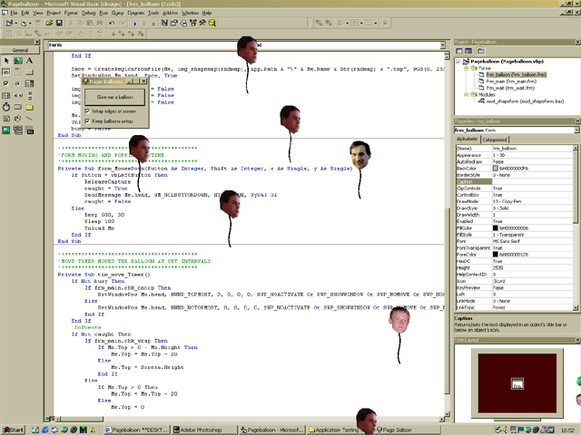



## Pageballoon \*\*DESKTOP TOY\!\!\!\*\*

### Description

This is PageBalloon (v 1.1.6), its your very own desktop toy, you can chuck as many balloons onto your desktop as you desire, they are all skin mapped with ex acquaintances of mine. Its a must see, and a good screensaver replacement. they can wrap around the screen to float off the top and come up from the bottom again, they can also be kept ontop at all times. I have improved the movement function a little to cut processing time and speed it up.so download the code, comment on the code, and vote the code!!!
 
### More Info
 

             |
---                |---
**Submitted On**   |2001-07-19 20:45:56
**By**             |[Niknak\!\!](https://github.com/Planet-Source-Code/PSCIndex/blob/master/ByAuthor/niknak.md)
**Level**          |Advanced
**User Rating**    |4.7 (33 globes from 7 users)
**Compatibility**  |VB 6\.0
**Category**       |[Complete Applications](https://github.com/Planet-Source-Code/PSCIndex/blob/master/ByCategory/complete-applications__1-27.md)
**World**          |[Visual Basic](https://github.com/Planet-Source-Code/PSCIndex/blob/master/ByWorld/visual-basic.md)
**Archive File**   |[Pageballoo231087192001\.zip](https://github.com/Planet-Source-Code/niknak-pageballoon-desktop-toy__1-25227/archive/master.zip)

